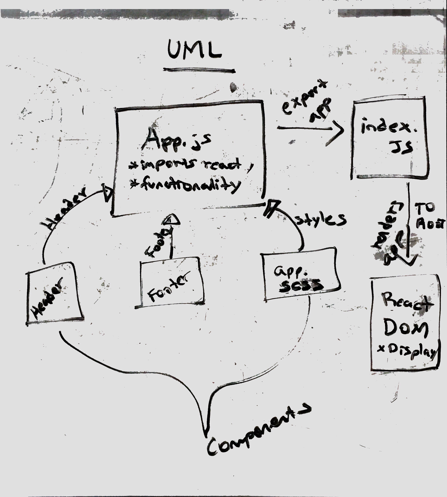

# LAB - 27 - Deployment and testing on React

### Author: Hanna Alemu

### Common npm Scripts
 "test": "react-scripts test --env=jsdom",
    "start": "react-scripts start",
    "build": "react-scripts build",
    "docs": "styleguidist server",
    "docs:build": "styleguidist build",
    "lint": "eslint src/**/*.js"

### Links and Resources
* [submission PR](http://xyz.com)

* [travis](https://www.travis-ci.com/401-advanced-javascript-hanna-alemu/Lab-27-Deployment/builds/128112427)

* [Amazon S3 bucket](http://hanna-alemu-lab-27.s3-website-us-west-2.amazonaws.com/) 

* [Amazon Amplify](https://master.d93u222e43m14.amplifyapp.com/)

* [Netlify](netlify https://vigorous-archimedes-87bad7.netlify.com/)

#### Documentation

* [styleguide](http://xyz.com) (React assignments)

#### Running the app
* `npm start`
  
#### Tests
$ npm run test

Tests pass locally, fixing travis

#### UML

